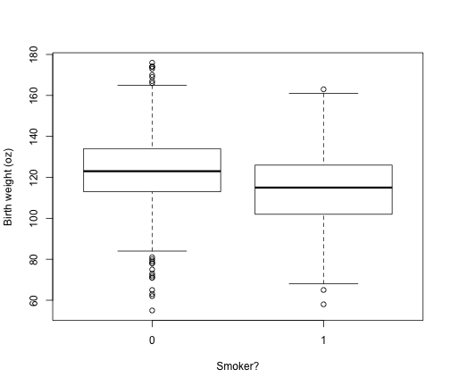
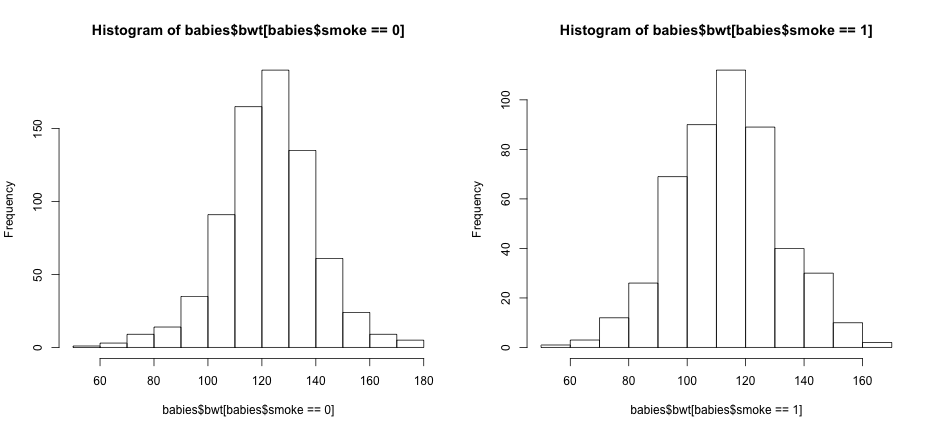
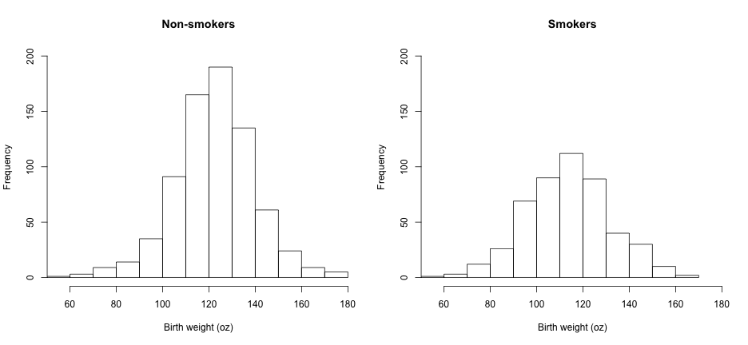

## Load the data


```r
babies = read.table("http://www.stat.berkeley.edu/users/statlabs/data/babiesI.data", 
    header = TRUE)
```


Alternatively, download the file to your computer and load it from your disk


```r
babies = read.table("~/Desktop/babiesI.data", header = TRUE)
```


---
Look at the top of the file to be sure it loaded okay:


```r
head(babies)
```

```
##   bwt smoke
## 1 120     0
## 2 113     0
## 3 128     1
## 4 123     0
## 5 108     1
## 6 136     0
```


* Question. What happens if you forget the "header=TRUE" part?

----
## Quantitative summaries

Get a summary of the data:


```r
summary(babies)
```

```
##       bwt          smoke      
##  Min.   : 55   Min.   :0.000  
##  1st Qu.:109   1st Qu.:0.000  
##  Median :120   Median :0.000  
##  Mean   :120   Mean   :0.464  
##  3rd Qu.:131   3rd Qu.:1.000  
##  Max.   :176   Max.   :9.000  
```


What are the units for bwt?

---
Why is "smoke" not just 0 or 1? Take a closer look


```r
table(babies$smoke)
```

```
## 
##   0   1   9 
## 742 484  10 
```


The book doesn't tell me what those 9s are, but the textbook website says it means smoking status is unknown. Replace them with NAs


```r
babies$smoke = replace(babies$smoke, babies$smoke == 9, NA)
```


---
Summary computes the mean, median, quartiles, min, max, but not the variance or standard deviation:


```r
var(babies$bwt)
```

```
## [1] 332.6
```

```r
sd(babies$bwt)
```

```
## [1] 18.24
```


Is that the variance and standard deviation of the population (dividing by n) or the bias-corrected value for a sample (dividing by n-1)? 

---
## Write your own var and sd functions to check with the built-in ones do:


```r
my.var = function(x) mean((x - mean(x))^2)
my.sd = function(x) sqrt(my.var(x))
my.var(babies$bwt)
```

```
## [1] 332.3
```

```r
my.sd(babies$bwt)
```

```
## [1] 18.23
```


So it's the bias corrected value, off by a factor of $(n-1)/n$ which can be confirmed by computing the ratio of the two variances


```r
(nrow(babies) - 1)/nrow(babies)
```

```
## [1] 0.9992
```

```r
my.var(babies$bwt)/var(babies$bwt)
```

```
## [1] 0.9992
```


---
Does the distribution of birth weights differ between smoking and non-smoking mothers? Here are two similar ways of doing the same thing. The "aggregate" method has a nicer name and you can add other variables to the grouping list "by"


```r
tapply(babies$bwt, babies$smoke, mean)
```

```
##     0     1 
## 123.0 114.1 
```

```r
aggregate(babies$bwt, by = list(babies$smoke), mean)
```

```
##   Group.1     x
## 1       0 123.0
## 2       1 114.1
```


---
Here are some more aggregated results


```r
aggregate(babies$bwt, by = list(babies$smoke), summary)
```

```
##   Group.1 x.Min. x.1st Qu. x.Median x.Mean x.3rd Qu. x.Max.
## 1       0     55       113      123    123       134    176
## 2       1     58       102      115    114       126    163
```

```r
aggregate(babies$bwt, by = list(babies$smoke), sd)
```

```
##   Group.1    x
## 1       0 17.4
## 2       1 18.1
```


---
## Qualitative summaries

Start with a histogram.


```r
hist(babies$bwt)
```

 


---
Then try a boxplot


```r
boxplot(babies)
```

 


---
Fix that!


```r
boxplot(bwt ~ smoke, data = babies, xlab = "Smoker?", ylab = "Birth weight (oz)")
```

 


---
Compare smoking and non-smoking mothers side by side


```r
par(mfrow = c(1, 2))
hist(babies$bwt[babies$smoke == 0])
hist(babies$bwt[babies$smoke == 1])
```

 

```r
par(mfrow = c(1, 1))
```


---
Fix the scales and labels


```r
par(mfrow = c(1, 2))
hist(babies$bwt[babies$smoke == 0], xlim = range(babies$bwt), ylim = c(0, 
    200), main = "Non-smokers", xlab = "Birth weight (oz)")
hist(babies$bwt[babies$smoke == 1], xlim = range(babies$bwt), ylim = c(0, 
    200), main = "Smokers", xlab = "Birth weight (oz)")
```

 

```r
par(mfrow = c(1, 1))
```


---
What do quantile plots show?


```r
qqnorm(babies$bwt)
qqline(babies$bwt)
```

 


---
Compare the birth weight data to a uniform distribution


```r
u = runif(nrow(babies))
qqplot(u, babies$bwt)
```

 


---
### Categories and tables


```r
table(cut(babies$bwt, c(0, 100, 125, 150, 200)), babies$smoke)
```

```
##            
##               0   1
##   (0,100]    62 111
##   (100,125] 353 248
##   (125,150] 289 113
##   (150,200]  38  12
```


---
### Define 'low birth weight' from histogram


```r
table(babies$bwt < 100, babies$smoke)
```

```
##        
##           0   1
##   FALSE 686 384
##   TRUE   56 100
```


---
What about a different threshold?


```r
table(babies$bwt < 90, babies$smoke)
```

```
##        
##           0   1
##   FALSE 717 444
##   TRUE   25  40
```

```r
table(babies$bwt < 120, babies$smoke)
```

```
##        
##           0   1
##   FALSE 444 182
##   TRUE  298 302
```


